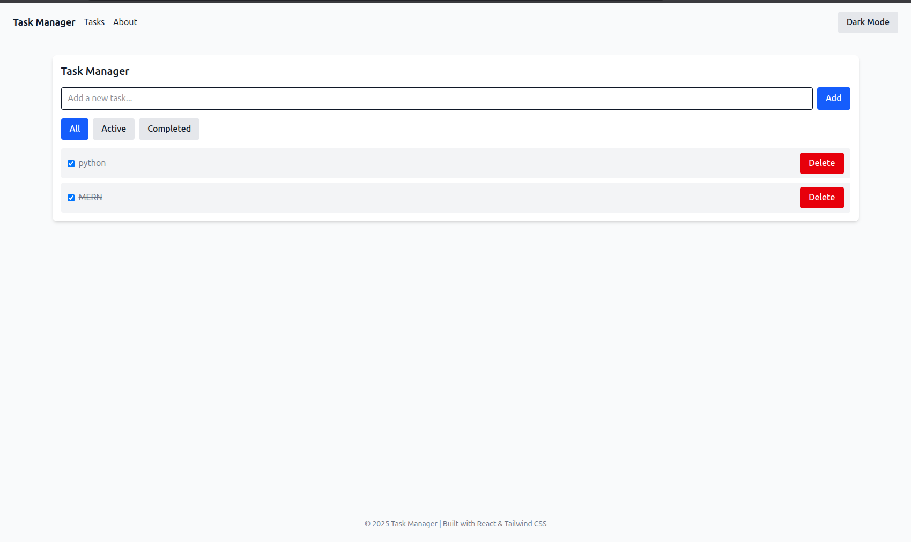
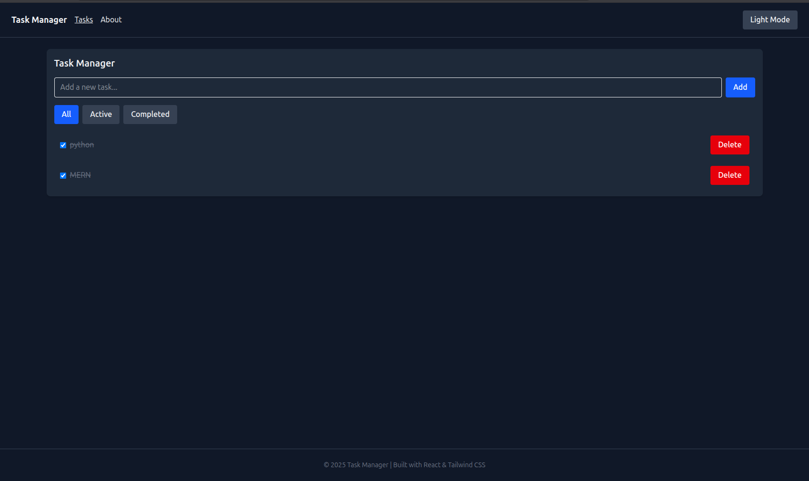

# 🌟 React JS, JSX, and CSS — Front-End Development Project

This project is part of the **PLP MERN Stack Development Program**, focusing on mastering **React**, **JSX**, and **modern CSS styling with Tailwind CSS v4.1**.  
It includes a working **dark/light theme toggle** and clean UI best practices.

---

## 🚀 Live Demo
🔗 **Deployed Application:** [Add your deployed URL here](https://your-vercel-or-netlify-link.vercel.app)

---

## 📸 Screenshots

### 🧩 Light Mode


### 🌙 Dark Mode



---

## 📁 Project Structure
```
react-js-jsx-and-css-mastering-front-end-development-AntolTECHS/
├── src/
│ ├── components/
│ ├── context/
│ │ └── ThemeProvider.jsx
│ ├── pages/
│ ├── App.jsx
│ ├── main.jsx
│ └── index.css
├── public/
├── package.json
├── README.md
└── vite.config.js


---

## ⚙️ Setup Instructions

Follow these steps to set up and run the project locally 👇  

### 1️⃣ Clone the repository (using SSH)
```bash
git clone git@github.com:PLP-MERN-Stack-Development/react-js-jsx-and-css-mastering-front-end-development-AntolTECHS.git
cd react-js-jsx-and-css-mastering-front-end-development-AntolTECHS

🎨 TECHNOLOGIES USED

⚛️ React — Component-based UI development
🎨 Tailwind CSS v4.1 — Utility-first styling
💡 JavaScript (ES6+) — Modern logic and interactivity
🌑 Theme Toggle Context — Light/Dark mode switching
⚡ Vite — Fast build tool for modern front-end apps

🧠 FEATURES

✅ Responsive design
✅ Light/Dark theme toggle
✅ Organized component structure
✅ Uses React Context for theme state management
✅ Configured with Tailwind CSS v4.1
✅ Ready for deployment on Vercel, Netlify, or GitHub Pages

🚀 Deployment
You can deploy this project easily on one of the following platforms:

▶️ Vercel (Recommended)

Go to https://vercel.com/
Import your GitHub repository
Wait for deployment to complete
Copy and paste the deployed URL above in the “Live Demo” section

▶️ Netlify

Drag and drop your project folder in https://app.netlify.com/
Connect your GitHub repo to enable auto-deploys

👨‍💻 Author

Name: AntolTECHS
Program: PLP MERN Stack Development
GitHub: @antolTECHS
