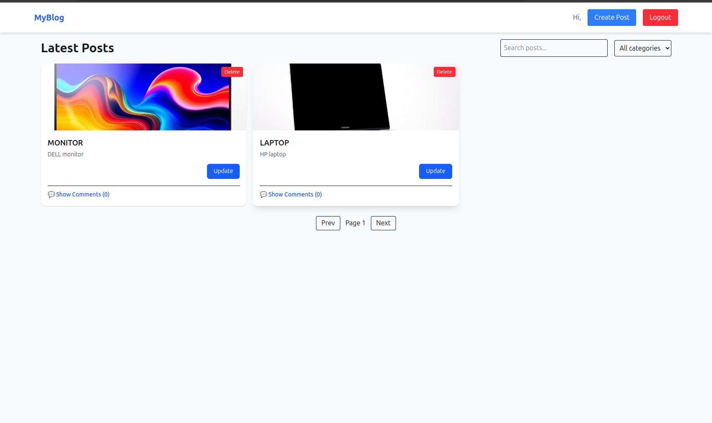
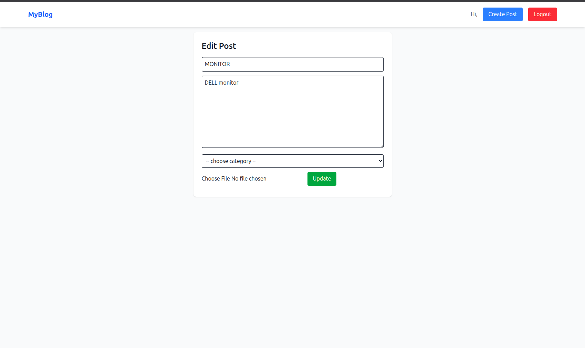
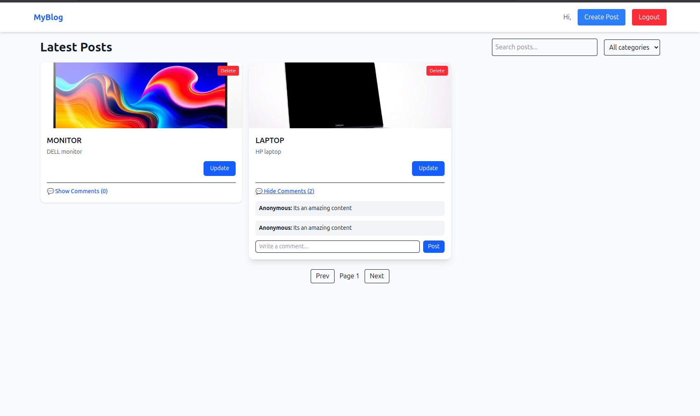

 HEAD
# 🌟 React JS, JSX, and CSS — Front-End Development Project

This project is part of the **PLP MERN Stack Development Program**, focusing on mastering **React**, **JSX**, and **modern CSS styling with Tailwind CSS v4.1**.  
It includes a working **dark/light theme toggle** and clean UI best practices.

---

## 🚀 Live Demo
🔗 **Deployed Application:** [Add your deployed URL here](https://your-vercel-or-netlify-link.vercel.app)

---

## 📸 Screenshots

### 🧩 Light Mode


### 🌙 Dark Mode


*(Create a folder named `screenshots/` in your project root and place your images there.)*

---

## 📁 Project Structure
```
react-js-jsx-and-css-mastering-front-end-development-AntolTECHS/
├── src/
│ ├── components/
│ ├── context/
│ │ └── ThemeProvider.jsx
│ ├── pages/
│ ├── App.jsx
│ ├── main.jsx
│ └── index.css
├── public/
├── package.json
├── README.md
└── vite.config.js

=======
# 📰 MERN Blog App

A **full-stack blogging platform** built using the **MERN stack** (MongoDB, Express.js, React.js, Node.js).  
Users can **register**, **log in**, **create posts** with images, **categorize content**, and **comment** on posts — all through an elegant and responsive UI.

---

## 🚀 Project Overview

The **MERN Blog App** is a modern web application designed for content creation and engagement.  
It provides a seamless experience for authors and readers alike, combining a RESTful API backend with a clean and interactive React frontend.

### 🧩 Tech Stack
- **Frontend:** React.js + Context API + Tailwind CSS
- **Backend:** Node.js + Express.js
- **Database:** MongoDB (Mongoose ODM)
- **Authentication:** JWT (JSON Web Tokens)
- **Image Uploads:** Multer + Local Storage
- **API Testing:** Postman
>>>>>>> a0af3be6db390e01ece103280c5ebaa77f24d238

---

## ⚙️ Setup Instructions

<<<<<<< HEAD
Follow these steps to set up and run the project locally 👇  

### 1️⃣ Clone the repository (using SSH)
```bash
git clone git@github.com:PLP-MERN-Stack-Development/react-js-jsx-and-css-mastering-front-end-development-AntolTECHS.git
cd react-js-jsx-and-css-mastering-front-end-development-AntolTECHS

🎨 TECHNOLOGIES USED

⚛️ React — Component-based UI development
🎨 Tailwind CSS v4.1 — Utility-first styling
💡 JavaScript (ES6+) — Modern logic and interactivity
🌑 Theme Toggle Context — Light/Dark mode switching
⚡ Vite — Fast build tool for modern front-end apps

🧠 FEATURES

✅ Responsive design
✅ Light/Dark theme toggle
✅ Organized component structure
✅ Uses React Context for theme state management
✅ Configured with Tailwind CSS v4.1
✅ Ready for deployment on Vercel, Netlify, or GitHub Pages

🚀 Deployment
You can deploy this project easily on one of the following platforms:

▶️ Vercel (Recommended)

Go to https://vercel.com/
Import your GitHub repository
Wait for deployment to complete
Copy and paste the deployed URL above in the “Live Demo” section

▶️ Netlify

Drag and drop your project folder in https://app.netlify.com/
Connect your GitHub repo to enable auto-deploys

👨‍💻 Author

Name: AntolTECHS
Program: PLP MERN Stack Development
GitHub: @antolTECHS
=======
### 1️⃣ Clone the Repository
```bash
git clone git@github.com:AntolTECHS/Mern_Blog-app.git
cd Mern_Blog-app


2️⃣ Setup the Server (Backend)
cd server
npm install

Create a .env file in /server:
PORT=5000
MONGO_URI=mongodb://localhost:27017/mernblog
JWT_SECRET=your_jwt_secret

Start the backend server:
npm run dev

Server runs on http://localhost:5000

3️⃣ Setup the Client (Frontend)
cd ../client
npm install
npm run dev

Frontend runs on http://localhost:5173

🧩 Folder Structure

Mern_Blog-app/
├── client/                 # React Frontend
│   ├── src/
│   │   ├── components/     # UI components (PostCard, etc.)
│   │   ├── contexts/       # Auth & Posts Context
│   │   ├── pages/          # Routes (Home, Create, Edit, etc.)
│   │   ├── services/       # API service (axios)
│   │   └── App.jsx
│   └── package.json
│
├── server/                 # Express Backend
│   ├── config/             # DB config
│   ├── controllers/        # API logic
│   ├── middleware/         # Auth & Error handling
│   ├── models/             # Mongoose models
│   ├── routes/             # Express routers
│   ├── uploads/            # Image uploads
│   └── server.js
│
└── README.md


## 🖼 Screenshots

**🏠 Home Page**  


**✏️ Update Page**  


**💬 Comments Section**  


🧑‍💻 Developer Notes

Make sure MongoDB is running locally:
sudo systemctl start mongod

Uploaded images are stored in the /uploads folder in the backend.
You can use Postman to test the API endpoints.


🧾 License
This project is open source and available under the MIT License

🤝 Author
👤 AntolTECHS

>>>>>>> a0af3be6db390e01ece103280c5ebaa77f24d238

